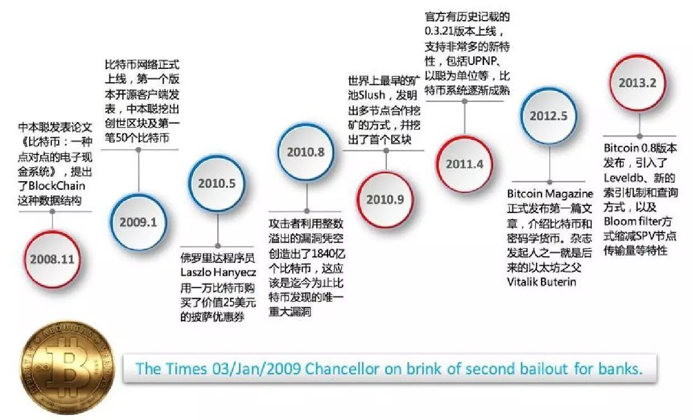
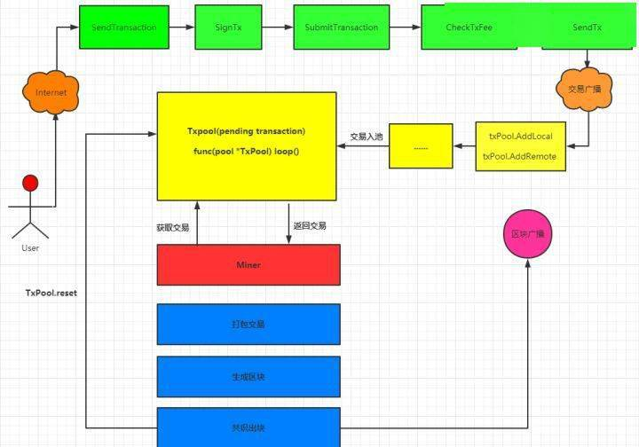

# 基于Poa协议的区块链上云实践
## 区块链起源
从p2p说起、迅雷、中本聪、2010年   
    2008年11月1日，一位自称中本聪(Satoshi Nakamoto)的人发表了《比特币:一种点对点的电子现金系统》一文，阐述了基于P2P网络技术、加密技术、时间戳技术、区块链技术等的电子现金系统的构架理念，这标志着比特币的诞生。两个月后理论步入实践，2009年1月3日第一个序号为0的创世区块诞生。几天后2009年1月9日出现序号为1的区块，并与序号为0的创世区块相连接形成了链，标志着区块链的诞生。    
（区块链历史）

### 什么是区块链
    区块链是一个信息技术领域的术语。从本质上讲，它是一个共享数据库，存储于其中的数据或信息，具有“不可伪造”“全程留痕”“可以追溯”“公开透明”“集体维护”等特征。
    狭义区块链是按照时间顺序，将数据区块以顺序相连的方式组合成的链式数据结构，并以密码学方式保证的不可篡改和不可伪造的分布式账本。
### 区块链核心技术
+ 分布式账本    
基于p2p技术，区块链的分布式存储的独特性主要体现在两个方面：一是区块链每个节点都按照块链式结构存储完整的数据，传统分布式存储一般是将数据按照一定的规则分成多份进行存储。二是区块链每个节点存储都是独立的、地位等同的，依靠共识机制保证存储的一致性，而传统分布式存储一般是通过中心节点往其他备份节点同步数据。没有任何一个节点可以单独记录账本数据，从而避免了单一记账人被控制或者被贿赂而记假账的可能性。也由记账节点足够多，理论上讲除非所有的节点被破坏，否则账目就不会丢失，从而保证了账目数据的安全性
+ 非对称加密    
在以太坊中，采用的ECIEC的加密套件中的其他内容：
1、其中HASH算法采用的是最安全的SHA3算法Keccak。
2、签名算法采用的是ECDSA
3、认证方式采用的是 H-MAC
4、ECC的参数体系采用了secp256k1,  其他参数体系参考这里
> https://www.jianshu.com/p/abfc4f442325
+ 共识机制
pow:工作量证明
### ETC和ETH
2016年发生区块链回滚事件
> https://baijiahao.baidu.com/s?id=1593738140573303509&wfr=spider&for=pc
## ETH区块链共识协议
+ pow协议：基于工作量证明
+ pos协议：基于权益系数证明
+ poa协议：基于权威证明
## 区块链上云
目前采用的是ETH的ethereum-go工程，使用poa协议进行部署（官方推荐）
### 设计思路
整体架构、StatefulSet、nfs、动态pvc、备份、双活、监控
### 动态nfs部署
动态部署nfs的作用、nfs部署过2程
### 部署过程中出现的问题
nfs网络策略问题、部署区块链的要点（genesis.json必须一样，account）、链重组、区块丢失问题、优雅结束、健康检测使用时的要点、出现问题时的解决方案。
### 智能合约
区块链是如何打包交易的

> https://www.imooc.com/article/272867

## 后记
区块链的影响：显卡内存条价格疯涨、数字人民币、区块链的出块天花板、区块链的集中化演变。个人认为，区块链技术给我们带来了一种去中心化的新思路，但是目前前景看起来还是比较迷茫。