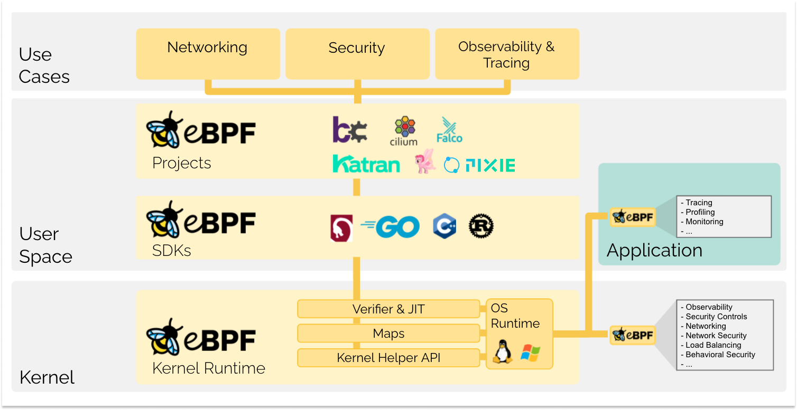

# eBPF 笔记
eBPF是一项革命性的技术，起源于 Linux 内核，可以在操作系统内核中运行沙盒程序。它用于安全有效地扩展内核的功能，而无需更改内核源代码或加载内核模块。
  
它允许将小程序加载到内核中，并附加到钩子上，这些钩子在某些事件发生时被触发。这甚至允许大量定制内核的行为。虽然 eBPF 虚拟机对于每种类型的钩子都是相同的，但钩子的功能却有很大差异。因为将程序加载到内核中可能很危险，所以内核通过非常严格的静态验证器运行所有程序；静态验证器对程序进行沙盒处理，确保它只能访问允许的内存部分，并确保它必须迅速终止。    
## 注意点
### calico eBPF会和kube-proxy冲突
因为ebpf会和kube-proxy冲突，比较好的方式是禁用掉kube-proxy。而禁用kube-proxy主要有两种方式，一种是直接将其对应的daemonset删除，另一种则是通过nodeSelector的方式将特定的node设置为不运行kube-proxy。从官方的文档来看两种方式各有优势，如果是初始化k8s集群的时候就直接使用ebpf的话可以考虑直接在初始化参数中将kube-proxy禁用，这里我们已经安装好了kube-proxy，则使用nodeSelector的方式控制会更为优雅
## 相关文章
> https://www.tigera.io/blog/introducing-the-calico-ebpf-dataplane/