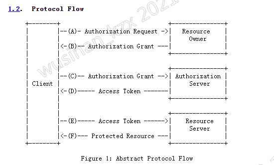

+ Oauth 2.0是做什么的?  
Oauth 2.0是用于向第三方应用颁发授权令牌的协议。Oauth 2.0划分了四种角色：client、resource owner、authorization server、resource server。协议流程图如下:

+ Oauth 2.0怎么实现单点登录
Oauth实现单点登录只需用到client、resouce owner、authorization server这三个角色。
